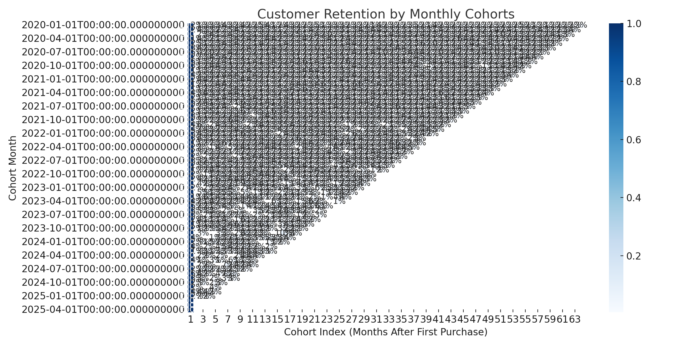

# Alt Mobility - Data Analyst Assignment

This repository contains all SQL queries, data visualizations, and findings from the Alt Mobility Data Analyst Intern assignment.

---

## 📁 Repository Structure

```
/
├── 01_order_sales_analysis.sql
├── 02_customer_analysis.sql
├── 03_payment_status_analysis.sql
├── 04_order_details_report.sql
├── 05_customer_retention.sql
├── AltMobility_Assignment_Summary_Report.docx
├── customer_retention_heatmap.png
├── customer_retention_cohort_data.csv
```

---

## ✅ Tasks & Approach

### 1. Order and Sales Analysis
- Counted total orders, grouped by status
- Tracked revenue trends over months
- Identified top 5 highest value orders

### 2. Customer Analysis
- Segmented customers by repeat purchase behavior
- Counted monthly new customers using cohort approach
- Analyzed order volume per customer

### 3. Payment Status Analysis
- Calculated success and failure rates by payment method
- Analyzed revenue impact of failed payments

### 4. Order Details Report
- Combined orders with payments in a single comprehensive report
- Derived key metrics like success %, avg value, and revenue loss

### 5. Customer Retention Analysis
- Built cohort tables for retention trend visualization
- Used Power BI matrix chart to highlight cohort repeat behavior over years

---

## 📊 Visualizations

### Retention Heatmap (Python)


### Retention Matrix (Power BI)
*Include exported screenshot image here in your repo*

---

## 🧾 Summary of Findings

Please refer to `AltMobility_Assignment_Summary_Report.docx` for key insights and actionable recommendations.

---

## 🛠 Tech Stack

- SQL
- Python (Pandas, Matplotlib, Seaborn)
- Power BI
- MS Word (Report Documentation)

---

## 👨‍💼 Author

*Prepared by [Your Name]* for Alt Mobility Internship Assignment (April 2025)